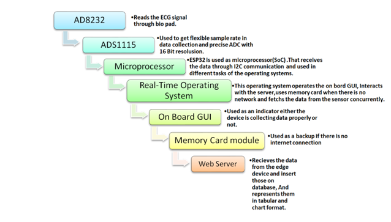
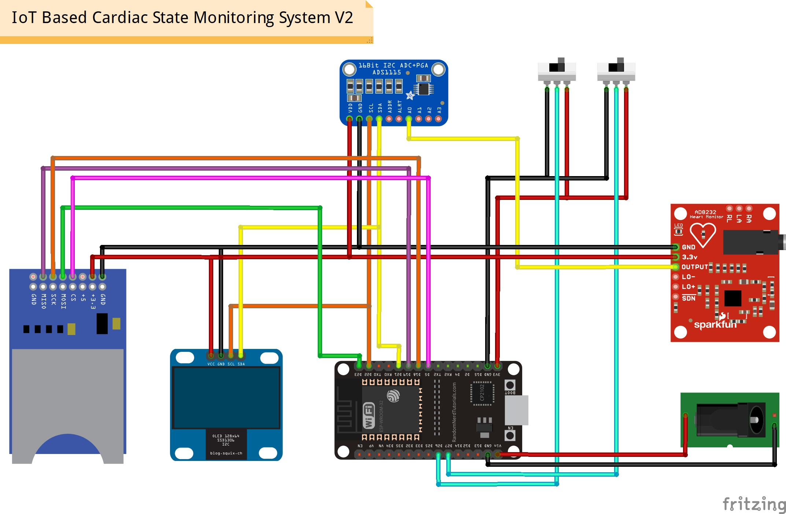
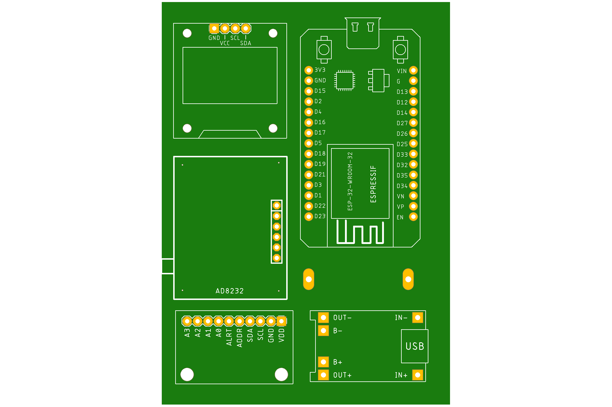
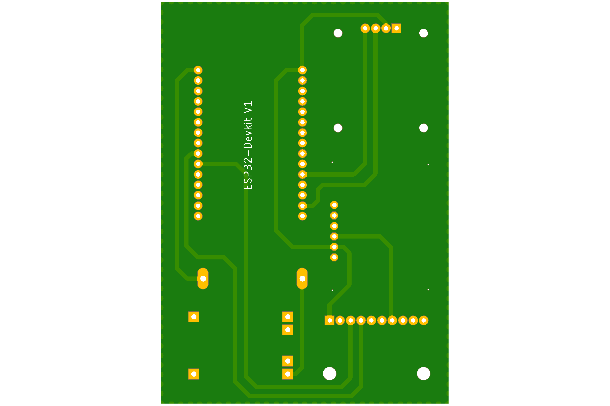
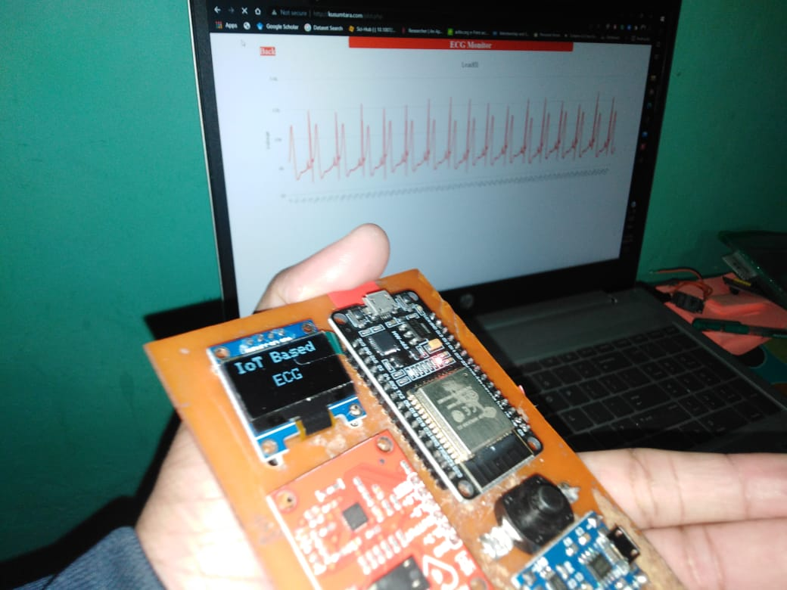
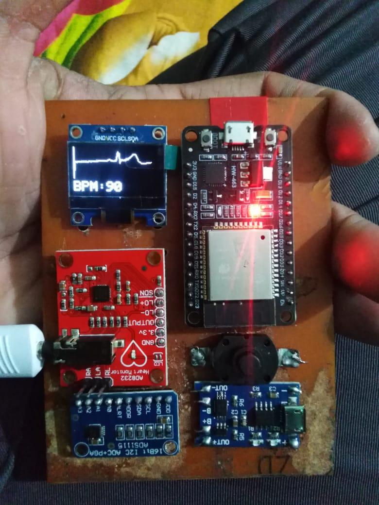

# IoT_Based_Cardiac_State_Monitoring_System

 **Description:**  
    The idea behind this project is to automate the Electrocardiogram,to make monitoring easy.That will reduce the human effort in Cardiac State Monitoring and will make healthcare possible in remote countryside.

**Hardware Specifications:**

* **Sensing**: Basically six types of sensors used in monitoring the water.medium and environment. These are:
   1. ESP-32(Doit esp32 devkit v1 board): It’s a really high quality SoC(system on chip) with Xtensa dual-core 32-bit LX6 microprocessor, operating at 160 or 240 MHz and performing at up to 600 DMIPS including a Ultra low power (ULP) co-processor.
   1. AD8232:  AD8232 ECG Module integrated with AD8232 IC from Analog Devices, which is a single-chip designed to extract, amplify, and filter bio-potential signals for bio-potential measurement applications (like ECG and others). ECGs can be extremely noisy so that the AD8232 Single Lead Heart Rate Monitor acts as an op-amp to help obtain a clear signal from the PR and QT Intervals easily. 
   1. ADS1115: It’s a 16-Bit ADC - 4 Channel with Programmable Gain Amplifier. That contains programmable data rate (8SPS to 860SPS). Arduino Nano is replaced by this because this is a dedicated ADC, that has higher bit resolution and configurable sample rate. 
   1. SD Card Module: It’s used to store the data in offline for analysis purpose.
   1. OLED display:  The OLED display is used for displaying the  ECG signal and BPM that is used as confirmation device working.

**Embedded Systems Informations:**

   1. Hardware: A high performance microprocessor is used with a very precise ADC (Analog to Digital Converter). And also a simple user interface with two mode (Analysis mode, IoT mode) will be included in recent.
   1. Software: In software we have used RTOS (Real Time Operating System) that includes a very precise task scheduling and memory management .Through that we can read the data of ECG, we can control the user interface and also we can interact with the cloud server in real time. That makes the embedded system more precise and fast.

**Work Flow:**    
        

**Circuit Layout:**  
Here is the circuit layout and the PCB Design of the electronic system.  

**Prototype View:**   
Here is some pictures of the prototyped system.  

**IoT web app:**    
     .png)
     .png)
     .png)
     .png)
     .png)
     .png)

 
