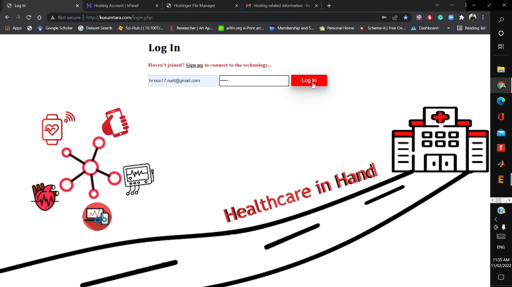
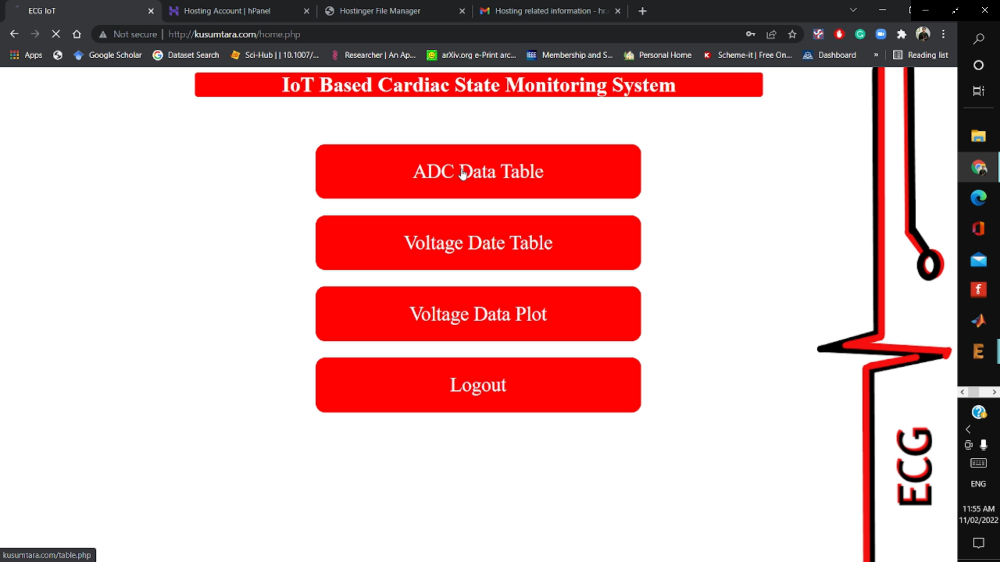
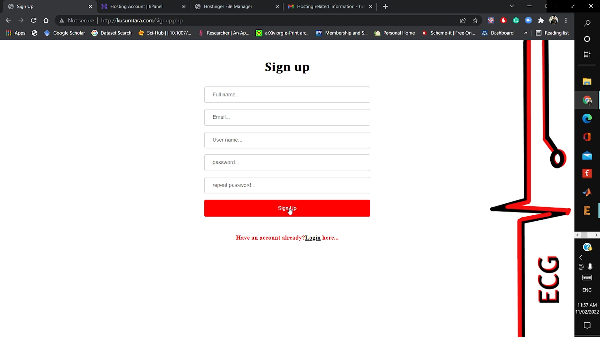
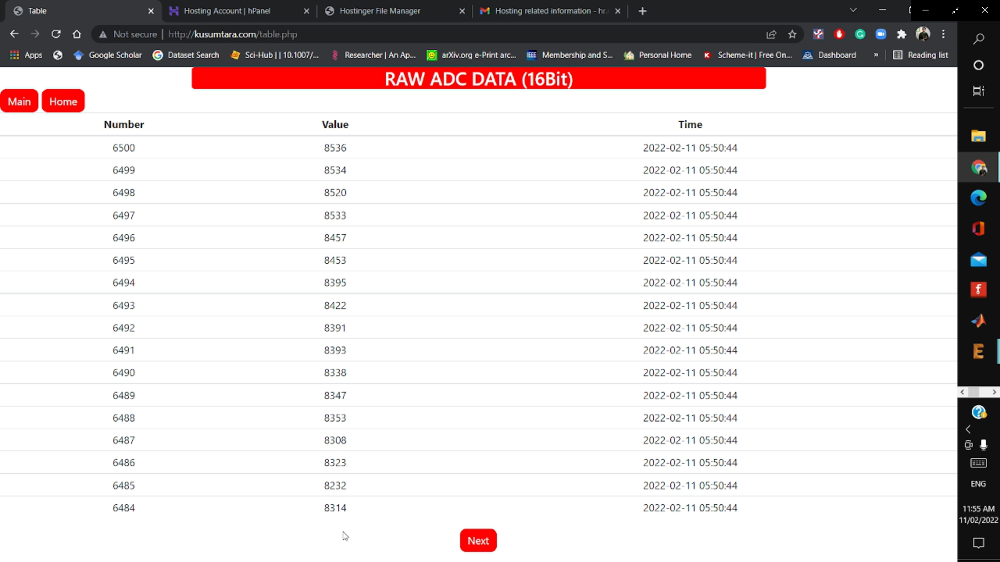
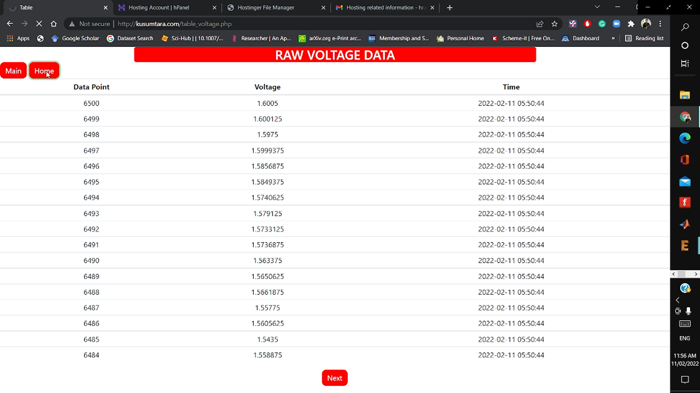

# IoT-Based Cardiac State Monitoring System

**Project Overview:**  
This project aims to automate Electrocardiogram (ECG) monitoring, reducing human effort in cardiac health assessment and enabling remote healthcare solutions, especially in rural areas.

---

### **Hardware Specifications**

1. **ESP32 (Doit ESP32 Devkit v1)**: High-performance SoC featuring a dual-core 32-bit LX6 microprocessor (160/240 MHz) with ultra-low power co-processor.  
2. **AD8232 ECG Module**: Extracts, amplifies, and filters bio-potential signals for clear ECG signal acquisition.  
3. **ADS1115**: 16-bit ADC with 4 channels and a programmable gain amplifier for high-resolution signal conversion.  
4. **SD Card Module**: Stores offline data for analysis.  
5. **OLED Display**: Displays real-time ECG signals and BPM.

---

### **Embedded System Details**

- **Hardware**: High-performance microprocessor with precise ADC. Includes a user interface supporting two modes: Analysis Mode and IoT Mode.  
- **Software**: Utilizes RTOS (Real-Time Operating System) for precise task scheduling and memory management. Functions include real-time ECG data acquisition, user interface control, and cloud server interaction for IoT functionality.

---

### **Workflow**  

---

### **Circuit Layout**  

  
  

---

### **Prototype View**  

  
  

---

### **IoT Web Application**  
Web interface for real-time monitoring:  
  
  
  
  
  
